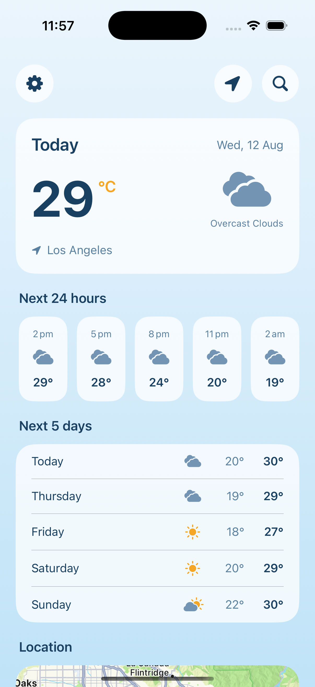
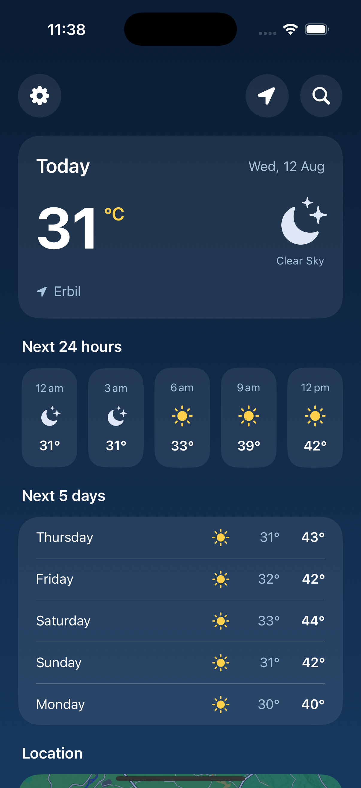
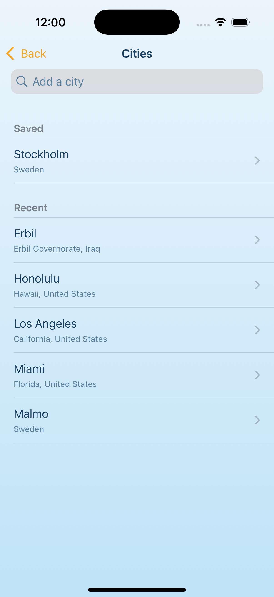

# SkyCast

An iOS weather app built with **UIKit and SwiftUI together**, powered by the OpenWeather API.

SkyCast shows the weather where you are, lets you search and save cities, and adapts its entire appearance to whether it's day or night in the place you're looking at.

| Day | Night | City search |
|---|---|---|
|  |  |  |

---

## Features

- **Weather for your location** — asks for location permission on first launch and falls back to a default city if it's denied
- **Current conditions** — temperature, feels-like, humidity, wind, and description
- **Next 24 hours** — a horizontally scrolling strip at three-hour intervals
- **Next 5 days** — daily highs and lows, derived from the three-hourly data
- **City search** — powered by OpenWeather's geocoding API, with results disambiguated by region and country
- **Saved and recent cities** — recents fill automatically as you browse; saved cities are curated by you
- **Unit settings** — °C/°F and m/s / km/h, persisted between launches
- **Day and night themes** — the palette switches based on the weather data itself, not the device clock
- **Location map** — shows where the displayed city is
- **Real error states** — no connection, city not found, and an inactive API key are each handled and explained

---

## Architecture

The app is deliberately **hybrid**: SwiftUI and UIKit each do the job they're better at. The table below shows where each framework sits, and the four points where they cross.

| Pattern | Where it's used |
|---|---|
| Storyboard-driven UIKit navigation | `Main.storyboard` → `UINavigationController` → `ViewController` |
| **UIKit hosting SwiftUI** | `UIHostingController(rootView: HomeView())` |
| **A full UIKit screen** | `CitiesViewController` — `UITableView`, `UISearchController`, delegates, debounced search |
| **SwiftUI pushed onto a UIKit stack** | `SettingsView` via `UIHostingController` |
| **UIKit inside SwiftUI** | `MapView` wraps `MKMapView` with `UIViewRepresentable` |

Underneath, the data layer is framework-agnostic — the models, networking, and view model have no idea whether a SwiftUI view or a `UIViewController` is displaying them.

### Layers

```
Models/       Codable types mirroring the OpenWeather responses, plus derived values
Services/     Networking, location, persistence — each behind a small surface
ViewModels/   HomeViewModel: one state enum that drives the whole screen
Views/        SwiftUI screens
Controllers/  UIKit view controllers
Support/      Theme, settings, API key
```

### A few decisions worth explaining

**One `State` enum instead of separate flags.** `HomeViewModel.State` is `idle | loading | loaded | failed`, so the screen is only ever in one of those at a time — it can't be loading and failed at once, the way separate booleans could be. Swift also refuses to compile a `switch` that misses a case, so the view has to say what loading and errors look like. They can't be forgotten and added later.

**Everything depends on `WeatherService`, not OpenWeather.** The protocol describes *what* fetching weather means. `OpenWeatherService` is one implementation; `MockWeatherService` in the tests is another. That's what lets the view-model tests run offline in milliseconds.

**Units convert at display time, not fetch time.** The app always requests metric and converts when rendering. Switching to Fahrenheit re-renders instantly with no network request, and cached data never ends up in mixed units.

**Day/night comes from the data, not the device.** OpenWeather's icon codes end in `d` or `n`, so viewing London at midnight from Baghdad at noon correctly shows the night theme — it reflects the city being displayed, not where the phone is.

**One generic networking method.** `fetch<T: Decodable>(_ path:_ items:)` serves all four endpoints — current weather, forecast, and geocoding — including one that returns a bare JSON array. Adding an endpoint is three lines, not forty.

**Times are the city's, not the device's.** Every forecast response carries the city's UTC offset. That timezone is threaded through the snapshot and used both for grouping days and for formatting times — so viewing Honolulu from Baghdad shows Honolulu's afternoon, rather than a sun icon under a "12 am" label. It's the kind of bug that stays invisible until you look up a distant city.

---

## Tests

**33 unit tests**, no network access, no simulator UI, running in well under a second.

```
DailySummaryTests      forecast grouping: one summary per calendar day, correct
                       min/max, midday icon, ordering, and the empty and
                       single-reading days that caused real bugs in development
UnitConversionTests    °C↔°F and m/s↔km/h, their formatting, and defaults
CityStoreTests         de-duplication, the ten-item cap on recents, newest-first
                       ordering, removal, list independence, and persistence
HomeViewModelTests     loaded / failed / idle states, coordinate pass-through,
                       hourly and daily limits, and theme derivation
```

Tests inject their own `Calendar` and `UserDefaults`, so results don't depend on the machine's timezone and never touch real user preferences.

Run them with **⌘U** in Xcode, or from the command line:

```bash
xcodebuild test -scheme SkyCast -destination 'platform=iOS Simulator,name=iPhone 16 Pro'
```

---

## Getting started

**Requirements:** Xcode 16+, iOS 17.6+

1. **Clone the repo** and open `SkyCast.xcodeproj`

2. **Get a free API key** from [openweathermap.org/api](https://openweathermap.org/api)
   New keys can take up to two hours to activate.

3. **Create `SkyCast/Support/Secrets.swift`:**

   ```swift
   import Foundation

   enum Secrets {
       static let openWeatherAPIKey = "YOUR_KEY_HERE"
   }
   ```

   This file is git-ignored and never committed.

4. **Run.** To test location handling in the simulator, set a location under
   **Features → Location → Custom Location** — the simulator has no GPS.

---

## Known limitations

Honest notes rather than hidden gaps:

- **Five days, not seven, and three-hourly rather than hourly.** That's what OpenWeather's free tier provides. True hourly data and an eight-day forecast require the One Call 3.0 subscription, which needs a payment card on file even for its free allowance.
- **No UV index**, for the same reason.
- **The device-location path isn't unit tested.** `HomeViewModel` creates its own `LocationService`. Extracting a protocol and injecting it — the same pattern already used for `WeatherService` — would close that gap.
- **The launch screen is Xcode's default.** It uses the system background colour, so the app flashes white — or black in dark mode — before the weather screen's gradient appears. Matching it to the palette is a one-line change, but a static launch screen can never fully match a theme that depends on the weather, since the app doesn't know the conditions until the network responds.

---

## Built with

Swift · SwiftUI · UIKit · async/await · CoreLocation · MapKit · Swift Testing · UserDefaults

No third-party dependencies.
